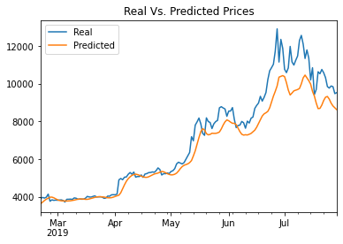
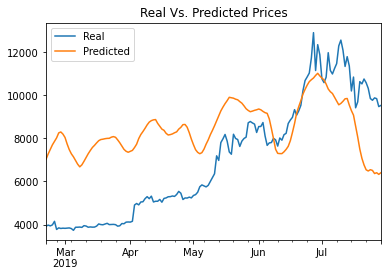

# LSTM Stock Predictor

## Preface

Some investors utilize sentiment from social media and news articles to improve their trading strategies, like Fear and Greed Index (FNG). 
I this assignment we will use deep learning recurrent neural networks to model bitcoin closing prices and the FNG indicators to predict the closing price. Finally, we evaluate deep learning models using both the FNG values and simple closing prices to determine if the FNG indicator provides a better signal for cryptocurrencies than the normal closing price data

To accomplish that, we will:

1. Prepare the data for training and testing
2. Build and train custom LSTM RNNs
3. Evaluate the performance of each model

- - -

## Prepare the data for training and testing

* For the closing price model, I used previous closing prices to predict the next closing price.

* For the FNG price model, I used FNG indices to predict the next closing price.

* Each model I used 70% of the data for training and 30% of the data for testing.

* Finally, applied a MinMaxScaler to the X and y values to scale the data for the model.
 - - -

## Build and train custom LSTM RNNs

For each model I used the following parameters to train and fit the model:
* window_size = 10
* number_units = 50
* dropout_fraction = 0.2
* epochs=50
* batch_size=10
* And a deep Neural Network with three LSTMs with Dropouts and one Dense layer at the end.

### Evaluate the performance of each model

> Which model has a lower loss?
> * LSTM RNN using Close price has lower loss with 0.0082 against the FNG model with a loss of  0.0772.
>
> Which model tracks the actual values better over time?
> * LSTM RNN with Close price diverges over the time since the model using FNG seems to be converged as time marches on. So, in general FNG models seems to be a better model over the time.

||
|:--:| 
| *Closing Model*|

||
|:--:| 
| *FNG Model*|

>
> Which window size works best for the model?
> * Window size of 5 seems to give better results for both  models.
